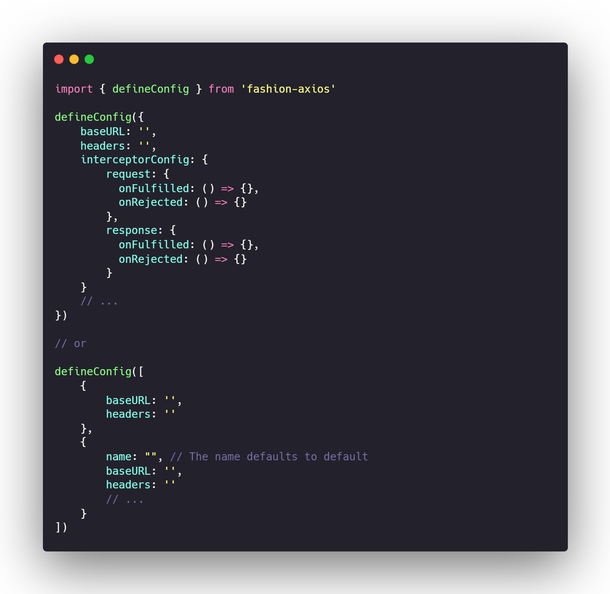
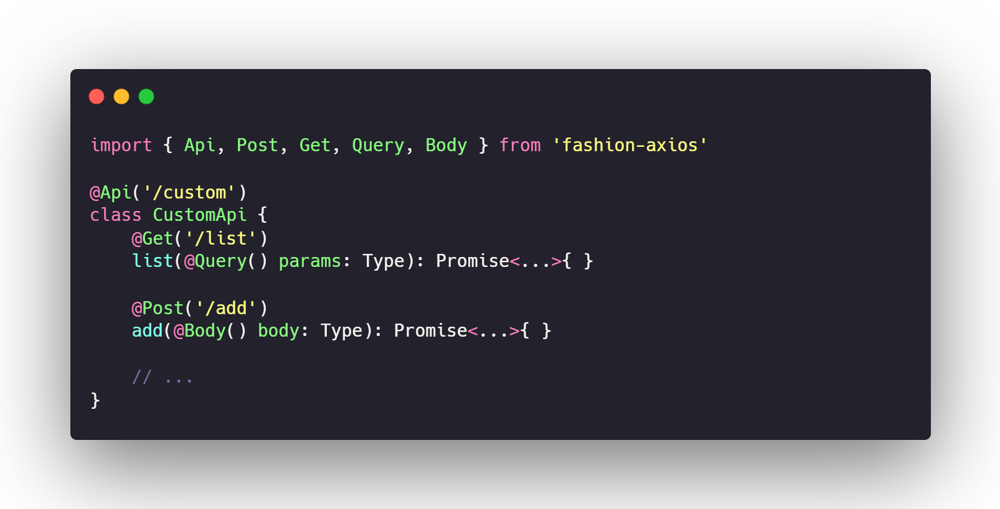

# fashion-axios

Based on axios to implement a network request library that can use decorators, refer to [Nest](https://github.com/nestjs/nest)

<p align="center">
    <!--  -->
    
</p>

## Purpose

Another way to manage APIs in a project, maybe expand to other more interesting experiments?

## Install

```bash

pnpm install fashion-axios -s
```

## Class Decorator

### @Api

```typescript
import { Api } from 'fashion-axios'

@Api('/user')
class UserApi {

}
```
### @Client

```typescript
import { Api } from 'fashion-axios'

@Client('name')
@Api('/user')
class UserApi {

}
```

## Request Decorator

```typescript
import { Api, Get, Post } from 'fashion-axios'

@Api('/user')
class UserApi {
    @Post('/add')
    add(): Type { }

    @Get('/list')
    list(): Type { }

    // ...more
    // @Put @Delete
}
```

## Param Decorator

```typescript
import { Api, Get, Post, Body, Query } from 'fashion-axios'

@Api('/user')
class UserApi {
    @Post('/add')
    add(@Body() body: Type): Type { }

    @Post('/update/:id')
    update(
        @Path('id') id: Type
        @Body() body: Type
    ): Type { }

    @Get('/list')
    list(@Query() params: Type): Type { }
}
```
