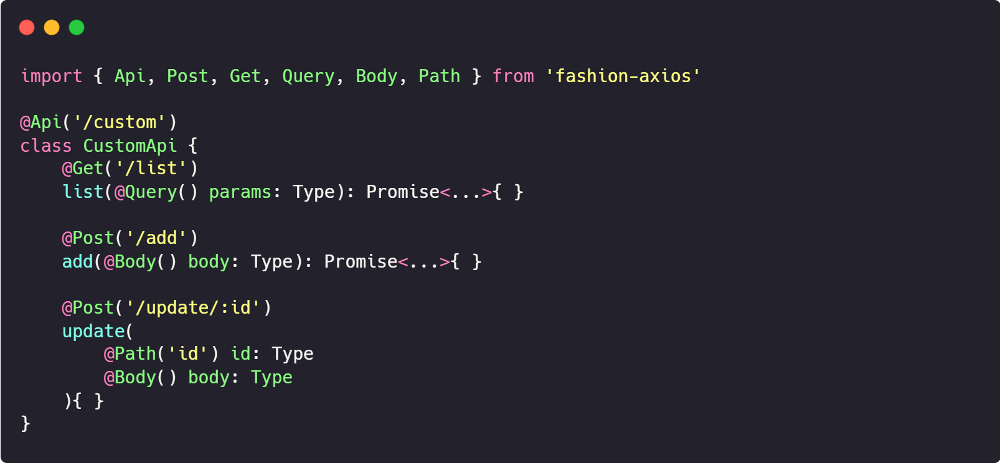

# fashion-axios

Based on axios to implement a network request library that can use decorators, refer to [Nest](https://github.com/nestjs/nest)

    <!--  -->
    

## Purpose

Another way to manage APIs in a project, maybe expand to other more interesting experiments?

## Install

## Class Decorator

## Request Decorator

## Param Decorator
